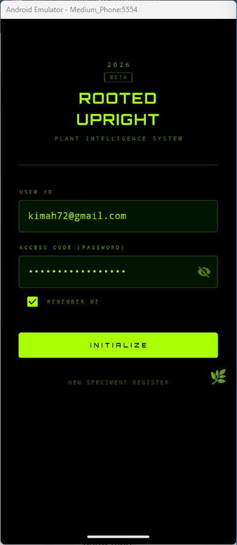
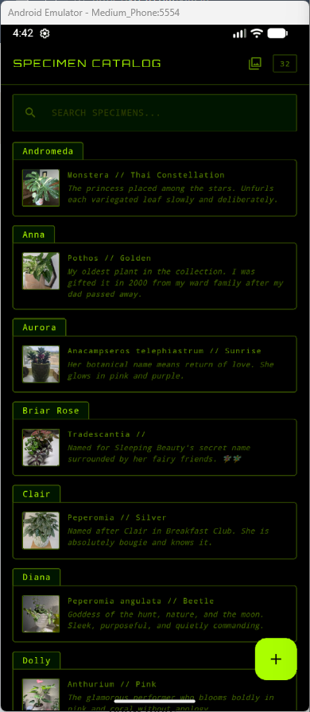
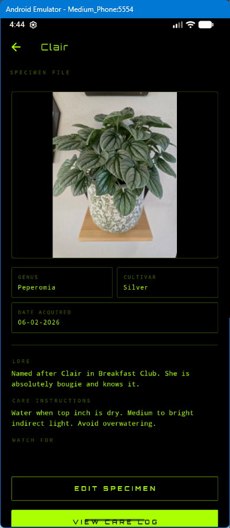
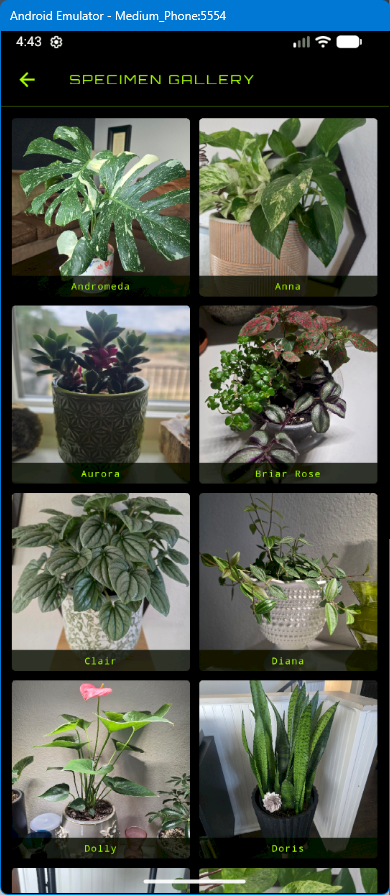
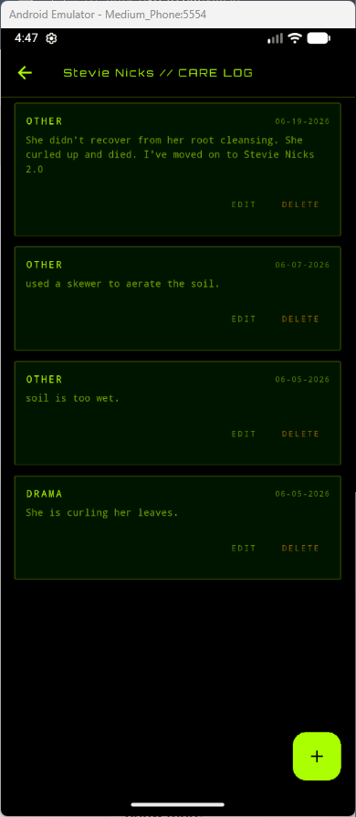

# Overview

As a software developer working toward a career in data engineering and cloud development, I wanted to push past tutorials and build something with a real production-style architecture: authentication, a cloud database, file storage, and a mobile client that talks to all of it. Rooted Upright Mobile is the Flutter companion to a web app I built earlier this year, and this module was my first time writing Dart and learning mobile development from scratch.

The app is a plant care companion for houseplant collectors. After creating a personal account, you land on a searchable catalog of your own plants, each with a name, species, cultivar, and a short piece of lore explaining where it came from or who it's named after. Tapping a plant opens its full specimen file: photo, care instructions, things to watch for, and a complete care log timeline. You can add new plants with a photo straight from your camera, edit any existing record, log care events like watering or repotting, and everything saves directly to the same AWS backend that powers the web version. Every account has its own private catalog, so the app works equally well for one plant or fifty.

I currently use it to track my own collection of over 30 named houseplants, several named after people I've lost, and keeping their care history and stories in one place that's turned a personal hobby into a real software project. It also let me practice connecting a brand new platform (Flutter/Dart) to an existing cloud architecture I designed myself, which is exactly the kind of cross-platform thinking I want to bring into a professional engineering role.

[Rooted Upright Mobile App](https://youtu.be/TAUuiOd3OLI)

# Development Environment

I built this app using VS Code as my primary editor with the Flutter and Dart extensions, and Android Studio for the Android SDK, emulator, and AVD manager. I tested on both the Android emulator and my physical Android device throughout development.

The app is written in Dart using the Flutter framework, targeting Android. It connects to a backend I built in an earlier module using AWS API Gateway, eight AWS Lambda functions (Node.js), and two DynamoDB tables for plants and care logs, with AWS Cognito handling user authentication. Plant photos are uploaded directly to an AWS S3 bucket via presigned URLs generated by a dedicated Lambda function.

Key Flutter packages used:
* google_fonts - for Orbitron and Share Tech Mono custom typography
* amazon_cognito_identity_dart_2 - for Cognito authentication
* http - for all API requests
* shared_preferences - for the remember me login feature
* image_picker - for camera and gallery photo selection
* url_launcher - for opening external links
* flutter_launcher_icons and flutter_native_splash - for custom branding

# Useful Websites

* [Flutter Documentation](https://docs.flutter.dev)
* [Flutter & Dart Crash Course](https://youtu.be/C-fKAzdTrLU)
* [pub.dev](https://pub.dev)

# Future Work

* Integrate the Anthropic API for AI-assisted plant identification, issue diagnosis from photos, and name suggestions based on collection style
* Build out a Rust CLI companion (planned for Module 5) that connects to the same backend for terminal-based care reminders
* Build a "needs attention" view that surfaces plants that haven't been logged in a while, sorted to the top of the catalog
* Add a quick-log button directly on catalog cards so common care actions don't require opening the full detail screen
* Implement offline caching with Hive so the catalog still loads with the most recent data if there's no internet connection
* Add success confirmation feedback (toast or snackbar) after actions like adding, editing, or deleting a plant or care log
* Add additional sort options beyond alphabetical, such as date added or most recently cared for
* Add the ability to delete or replace a plant's photo without going through the full edit form
